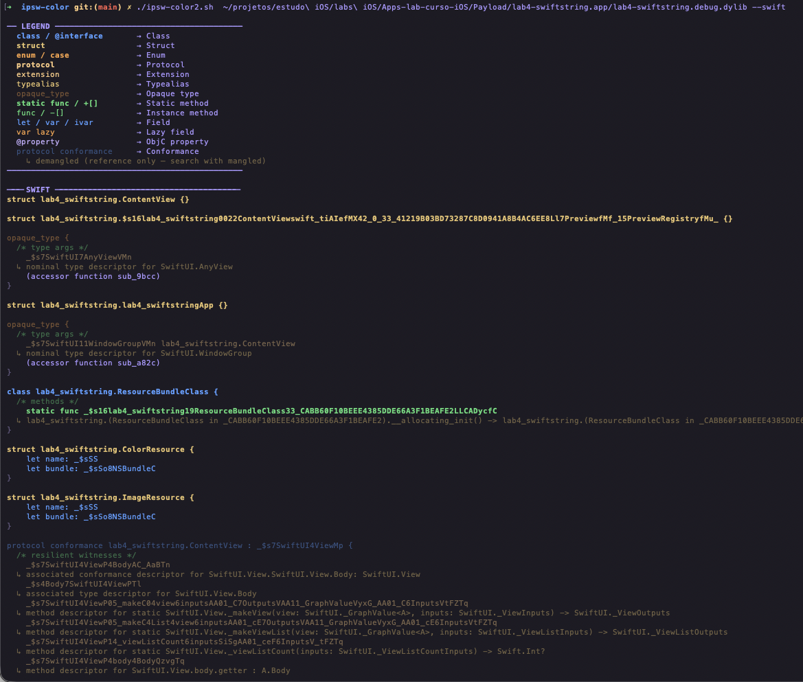
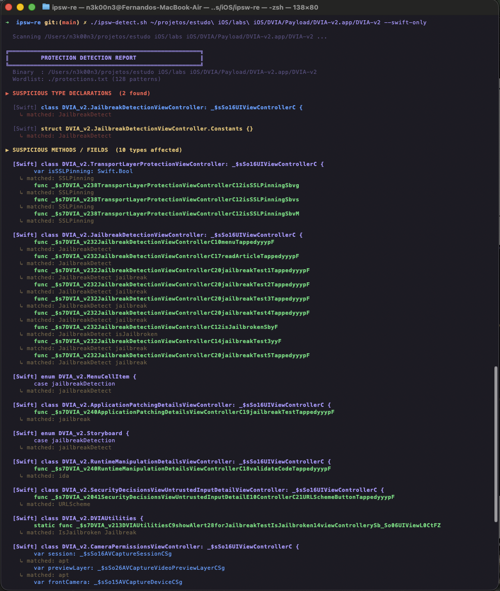

# ipsw-re

Static analysis scripts for iOS binaries, built on top of the [`ipsw`](https://github.com/blacktop/ipsw) CLI tool.

The goal is to speed up the initial recon phase of iOS reverse engineering — without running the app, without a jailbroken device, and without a debugger. You get a fast overview of what protections are implemented and a colorized view of the binary's Swift/ObjC structure.

---

## Scripts

### `ipsw-color.sh` — Colorized binary structure viewer

Runs `ipsw macho info --swift` and/or `--objc` and colorizes the output by symbol type (classes, methods, fields, enums, protocols). Mangled Swift symbols are automatically demangled and shown as inline hints.

```bash
./ipsw-color.sh <binary>            # Swift + ObjC
./ipsw-color.sh <binary> --swift
./ipsw-color.sh <binary> --objc
```

<!-- INSERT SCREENSHOT: ipsw-color.sh output example -->

---

### `ipsw-detect.sh` — Static protection detector

Scans the binary's Swift/ObjC symbol tree against a wordlist of known protection patterns (jailbreak detection, Frida/anti-instrumentation, SSL pinning, debugger checks, and more). Results are grouped by parent type and annotated with the matched pattern.

```bash
./ipsw-detect.sh <binary>                           # Swift + ObjC
./ipsw-detect.sh <binary> --swift-only
./ipsw-detect.sh <binary> --objc-only
./ipsw-detect.sh <binary> --wordlist /path/to/custom.txt
```


---

## Requirements

- [`ipsw`](https://github.com/blacktop/ipsw) — `brew install blacktop/tap/ipsw`
- `bash` 3.2+ (macOS default shell compatible)
- `swift-demangle` (optional, improves `ipsw-color.sh` output) — included with Xcode

## Wordlist

`protections.txt` contains 128 patterns across 9 categories:

- Jailbreak detection
- Frida / instrumentation
- Debugger / anti-tamper
- Reverse engineering tools
- Hooking / method swizzling
- SSL / certificate pinning
- Integrity / tamper checks
- Root / file system checks
- Environment / emulator checks

Lines starting with `#` are treated as comments and ignored. You can extend or replace the wordlist using `--wordlist`.

